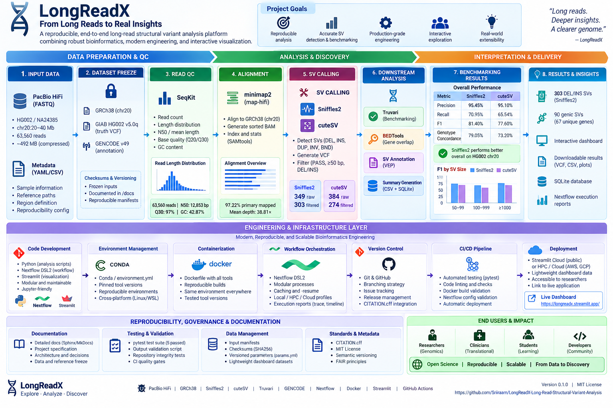

# LongReadX — Long-Read Structural Variant Analysis

[](https://www.nextflow.io/)
[](https://www.pacb.com/)
[](https://github.com/lh3/minimap2)
[](https://www.htslib.org/)
[](https://www.htslib.org/)
[](https://bedtools.readthedocs.io/)
[](https://github.com/fritzsedlazeck/Sniffles)
[](https://github.com/tjiangHIT/cuteSV)
[](https://github.com/ACEnglish/truvari)
[](https://www.nist.gov/programs-projects/genome-bottle)
[](https://www.gencodegenes.org/)
[](https://www.python.org/)
[](https://pandas.pydata.org/)
[](https://www.sqlite.org/)
[](https://www.docker.com/)
[](https://pytest.org/)
[](https://github.com/Sriiraam/LongReadX-Long-Read-Structural-Variant-Analysis/actions)
[](https://longreadx.streamlit.app/)
[](LICENSE)
[](CITATION.cff)
[](https://github.com/Sriiraam/LongReadX-Long-Read-Structural-Variant-Analysis/releases)
[](https://github.com/Sriiraam/LongReadX-Long-Read-Structural-Variant-Analysis)

---

## Overview

**LongReadX** is a reproducible long-read structural variant (SV) analysis and benchmarking workflow built around **PacBio HiFi sequencing** from the Genome in a Bottle **HG002 / NA24385** reference sample.

The project implements an end-to-end workflow covering:

**HiFi FASTQ → read QC → alignment → BAM QC → structural variant calling → filtering → GIAB benchmarking → gene-overlap annotation → structured summaries → SQLite → interactive dashboard**

The workflow is orchestrated using **Nextflow DSL2** and compares two long-read structural variant callers:

- **Sniffles2**
- **cuteSV**

Predicted variants are benchmarked against **GIAB HG002 v5.0q structural-variant truth data** using **Truvari**.

The final workflow also incorporates **GENCODE gene annotation**, automated validation, Docker containerization, GitHub Actions CI, structured data products, and a multi-page Streamlit dashboard.

> LongReadX intentionally uses a compact chromosome 20 benchmark interval rather than whole-genome long-read data so that a genuine long-read SV workflow remains reproducible on modest local hardware.

---

## 🌐 Live Dashboard

Explore LongReadX interactively:

[**Launch LongReadX Dashboard →**](https://longreadx.streamlit.app/)

The dashboard contains dedicated views for:

- Long-read QC
- Alignment QC
- Structural Variant Explorer
- Gene Overlaps
- Caller Comparison
- Benchmarking
- Engineering Performance

The deployed application uses compact derived result tables rather than the original large sequencing files.

---

# 🎯 Project Objective

Long-read sequencing provides an important advantage for detecting genomic rearrangements that are difficult to resolve using short-read sequencing.

The main objective of LongReadX is to demonstrate a complete, reproducible workflow for:

1. processing PacBio HiFi long reads,
2. aligning reads against GRCh38,
3. detecting structural variants using independent callers,
4. filtering clinically/genomically relevant SV classes,
5. benchmarking predictions against a high-confidence GIAB truth set,
6. evaluating caller performance by SV type and size,
7. identifying gene-overlapping structural variants,
8. producing analysis-ready structured outputs,
9. storing summary information in SQLite,
10. exposing results through an interactive dashboard,
11. validating the repository automatically,
12. supporting reproducible execution through Nextflow and Docker.

---

# 🧪 Dataset

## Sample

| Property | Value |
|---|---|
| Sample | HG002 |
| Alias | NA24385 |
| Sequencing platform | PacBio |
| Read technology | HiFi / CCS |
| Genome build | GRCh38 |
| Chromosome | chr20 |
| Analysis interval | chr20:20,000,001–40,000,000 |
| Interval size | 20 Mb |
| Truth source | Genome in a Bottle |
| Truth release | GIAB v5.0q |

The source alignment metadata indicates that the original HG002 data were aligned using **pbmm2 with the CCS preset** and subsequently haplotagged using **WhatsHap**.

For LongReadX, primary HiFi reads from the locked regional dataset were converted back to FASTQ and independently realigned using minimap2.

---

# 🔒 Dataset and Region Freeze

To keep the project computationally practical and reproducible, LongReadX uses a frozen 20 Mb region:

```text
chr20:20,000,001-40,000,000
```

The extracted FASTQ contains:

```text
63,560 reads
```

Compressed FASTQ size:

```text
~492 MB
```

The complete working biological dataset remained within the project's approximately **1.5 GB active-data design target** during initial setup.

Large sequencing and reference files are intentionally excluded from GitHub through `.gitignore`.

---

# 🧬 Reference Genome

Reference:

```text
GRCh38 no-alt analysis set
```

Chromosome used:

```text
chr20
```

Reference chromosome length:

```text
64,444,167 bp
```

Reference FASTA:

```text
data/reference/GRCh38_chr20.fa
```

The reference is indexed using:

```bash
samtools faidx
```

The chromosome length was validated against the input BAM header.

---

# 🧬 Gene Annotation

Gene annotation is derived from:

**GENCODE v49**

Chromosome 20 gene records:

```text
1,970
```

The annotation was converted into a BED representation containing:

```text
chromosome
start
end
gene_id
gene_name
gene_type
```

Gene overlap analysis is performed using **BEDTools intersect**.

---

## 🏗️ Workflow Architecture



The architecture combines the complete biological workflow with the engineering and reproducibility layers used in LongReadX, including PacBio HiFi, SeqKit, minimap2, SAMtools, Sniffles2, cuteSV, Truvari, GENCODE, BEDTools, Nextflow DSL2, Docker, pytest, GitHub Actions, SQLite and Streamlit.


```text
                    ┌──────────────────────────────┐
                    │     PacBio HiFi FASTQ        │
                    │       HG002 / NA24385        │
                    └──────────────┬───────────────┘
                                   │
                                   ▼
                    ┌──────────────────────────────┐
                    │          READ_QC             │
                    │           SeqKit             │
                    └──────────────┬───────────────┘
                                   │
                                   ▼
                    ┌──────────────────────────────┐
                    │      MINIMAP2_ALIGN          │
                    │       map-hifi preset        │
                    └──────────────┬───────────────┘
                                   │
                                   ▼
                    ┌──────────────────────────────┐
                    │           BAM_QC             │
                    │          SAMtools            │
                    └──────────────┬───────────────┘
                                   │
                         ┌─────────┴─────────┐
                         │                   │
                         ▼                   ▼
              ┌──────────────────┐  ┌──────────────────┐
              │    Sniffles2     │  │      cuteSV      │
              │    SV Caller     │  │    SV Caller     │
              └────────┬─────────┘  └────────┬─────────┘
                       │                     │
                       ▼                     ▼
              ┌──────────────────┐  ┌──────────────────┐
              │    SV Filter     │  │    SV Filter     │
              │ DEL / INS ≥50 bp │  │ DEL / INS ≥50 bp │
              └────────┬─────────┘  └────────┬─────────┘
                       │                     │
                       └──────────┬──────────┘
                                  │
                     ┌────────────┴─────────────┐
                     │                          │
                     ▼                          ▼
          ┌─────────────────────┐    ┌─────────────────────┐
          │ Truvari Benchmark   │    │   Gene Annotation   │
          │   GIAB v5.0q        │    │  GENCODE + BEDTools │
          └──────────┬──────────┘    └──────────┬──────────┘
                     │                          │
                     └────────────┬─────────────┘
                                  │
                                  ▼
                    ┌───────────────────────────┐
                    │     Summary Generation    │
                    │    CSV + SQLite outputs   │
                    └─────────────┬─────────────┘
                                  │
                                  ▼
                    ┌───────────────────────────┐
                    │   Streamlit Dashboard     │
                    └───────────────────────────┘
```

---

# ⚙️ Core Technologies

| Layer | Technology |
|---|---|
| Workflow orchestration | Nextflow DSL2 |
| Long-read technology | PacBio HiFi |
| Read QC | SeqKit |
| Alignment | minimap2 |
| Alignment processing | SAMtools |
| VCF processing | BCFtools |
| Primary SV caller | Sniffles2 |
| Comparison SV caller | cuteSV |
| Benchmarking | Truvari |
| Truth dataset | GIAB HG002 v5.0q |
| Gene annotation | GENCODE v49 |
| Genomic interval operations | BEDTools |
| Analysis scripting | Python |
| Tabular processing | pandas |
| Variant access | pysam |
| Structured storage | SQLite |
| Testing | pytest |
| Containerization | Docker |
| CI | GitHub Actions |
| Dashboard | Streamlit |
| Visualization | Plotly |
| Version control | Git + GitHub |

---

# 📊 Long-Read QC

The extracted PacBio HiFi dataset contains:

| Metric | Result |
|---|---:|
| Reads | 63,560 |
| Total bases | 814,861,732 |
| Mean read length | 12,820.4 bp |
| N50 | 12,853 bp |
| Maximum read length | 25,905 bp |
| Q20 bases | 99% |
| Q30 bases | 97% |
| Average quality | 28.56 |
| GC content | 42.87% |

These results demonstrate the expected characteristics of high-accuracy PacBio HiFi reads: long read lengths combined with high base-level quality.

---

# 🧭 Alignment

HiFi reads are aligned against GRCh38 chromosome 20 using:

```text
minimap2 map-hifi
```

Alignment output is coordinate sorted and indexed for downstream structural variant analysis.

## Alignment QC

Key SAMtools flagstat results:

| Metric | Result |
|---|---:|
| Total alignment records | 106,984 |
| Primary reads | 63,560 |
| Secondary alignments | 39,285 |
| Supplementary alignments | 4,139 |
| Mapped records | 105,220 |
| Overall mapped | 98.35% |
| Primary mapped reads | 61,796 |
| Primary mapping rate | 97.22% |
| Duplicates | 0 |

Secondary and supplementary records are expected in long-read alignment because individual reads can produce alternative or split alignments, particularly around repetitive regions and structural rearrangements.

---

# 📈 Regional Coverage

Coverage was evaluated over:

```text
chr20:20,000,001-40,000,000
```

| Metric | Result |
|---|---:|
| Region size | 20,000,000 bp |
| Covered bases | 19,243,277 bp |
| Breadth ≥1× | 96.22% |
| Mean depth | 38.81× |
| Mean mapping quality | 51 |

The source regional BAM independently showed approximately 40× mean depth, while the LongReadX realignment produced approximately 38.8× regional depth.

---

# 🔍 Structural Variant Calling

LongReadX uses two independent long-read SV callers.

## Sniffles2

Raw calls:

```text
349 SVs
```

Raw SV composition:

| SV type | Count |
|---|---:|
| DEL | 162 |
| INS | 155 |
| BND | 25 |
| INV | 5 |
| DUP | 2 |

## cuteSV

Raw calls:

```text
384 SVs
```

Raw SV composition:

| SV type | Count |
|---|---:|
| INS | 192 |
| DEL | 183 |
| DUP | 6 |
| INV | 3 |

---

# 🧹 Structural Variant Filtering

The principal benchmarking analysis focuses on:

```text
PASS
DEL / INS
SV length ≥ 50 bp
locked chr20 region
```

Filtered caller outputs:

| Caller | DEL | INS |
|---|---:|---:|
| Sniffles2 | 156 | 154 |
| cuteSV | 123 | 151 |

Further benchmark-region restrictions are applied by Truvari using the GIAB high-confidence BED.

---

# 🧪 GIAB Benchmark Truth

LongReadX benchmarks predicted structural variants against:

**Genome in a Bottle HG002 GRCh38 v5.0q**

Within the locked regional truth extraction:

| Type | Total |
|---|---:|
| DEL | 148 |
| INS | 195 |

However, not all of these records represent ≥50 bp benchmarkable structural variants.

## Truth Size Distribution

| Type | <30 bp | 30–49 bp | 50–50,000 bp |
|---|---:|---:|---:|
| DEL | 59 | 38 | 51 |
| INS | 54 | 39 | 102 |

Therefore, the ≥50 bp type-specific truth set contains:

```text
51 deletions
102 insertions
```

Truvari additionally applies the supplied GIAB benchmark BED and its benchmark filtering rules during comparison.

---

# 🏆 Overall Benchmarking

Benchmarking is performed using:

```text
Truvari 5.4.0
```

with GIAB HG002 v5.0q truth.

## Overall Performance

| Metric | Sniffles2 | cuteSV |
|---|---:|---:|
| TP | **105** | 97 |
| FP | 5 | 5 |
| FN | **43** | 51 |
| Precision | **95.45%** | 95.10% |
| Recall | **70.95%** | 65.54% |
| F1 | **81.40%** | 77.60% |
| Genotype concordance | **79.05%** | 73.20% |

### Result

For this HG002 chr20 benchmark:

**Sniffles2 produced the stronger overall result.**

Both callers achieved very high precision, while Sniffles2 recovered a larger proportion of the GIAB benchmark truth set and consequently achieved higher recall and F1.

---

# 🧬 Benchmarking by SV Type

## Deletions

| Metric | Sniffles2 | cuteSV |
|---|---:|---:|
| TP | **36** | 33 |
| FP | 0 | 0 |
| FN | **10** | 13 |
| Precision | **100.00%** | **100.00%** |
| Recall | **78.26%** | 71.74% |
| F1 | **87.80%** | 83.54% |
| Genotype concordance | **88.89%** | 87.88% |

Both callers achieved perfect precision for benchmarkable deletions, with Sniffles2 providing higher recall.

## Insertions

| Metric | Sniffles2 | cuteSV |
|---|---:|---:|
| TP | **69** | 64 |
| FP | 5 | 5 |
| FN | **33** | 38 |
| Precision | **93.24%** | 92.75% |
| Recall | **67.65%** | 62.75% |
| F1 | **78.41%** | 74.85% |
| Genotype concordance | **73.91%** | 65.63% |

Insertion detection was more challenging than deletion detection for both callers.

---

# 📏 Benchmarking by SV Size

LongReadX additionally evaluates performance across three structural variant size classes.

## Sniffles2

| SV size | TP | FP | FN | Precision | Recall | F1 |
|---|---:|---:|---:|---:|---:|---:|
| 50–99 bp | 29 | 2 | 9 | 93.55% | 76.32% | 84.06% |
| 100–999 bp | 60 | 3 | 27 | 95.24% | 68.97% | 80.00% |
| ≥1000 bp | 16 | 0 | 7 | **100.00%** | 69.57% | 82.05% |

## cuteSV

| SV size | TP | FP | FN | Precision | Recall | F1 |
|---|---:|---:|---:|---:|---:|---:|
| 50–99 bp | 25 | 2 | 13 | 92.59% | 65.79% | 76.92% |
| 100–999 bp | 57 | 4 | 30 | 93.44% | 65.52% | 77.03% |
| ≥1000 bp | 14 | 0 | 9 | **100.00%** | 60.87% | 75.68% |

### Interpretation

Sniffles2 achieved higher F1 across all three evaluated size categories.

Both callers achieved:

```text
100% precision for ≥1 kb SVs
```

within this benchmark subset.

---

# 📐 SV Size Distribution

The final Sniffles2-derived structural variant dataset contains:

```text
303 DEL/INS structural variants
```

## Summary

| SV type | Count | Median length | Mean length | Maximum length |
|---|---:|---:|---:|---:|
| DEL | 149 | 305 bp | 3,163.96 bp | 286,718 bp |
| INS | 154 | 236 bp | 620.08 bp | 8,553 bp |

The large difference between median and mean deletion length reflects the presence of a smaller number of substantially larger deletions.

---

# 🧬 Gene Overlap Analysis

Structural variants from the primary Sniffles2 result are intersected with GENCODE chromosome 20 gene coordinates.

Final gene-overlap summary:

| Metric | Result |
|---|---:|
| Total structural variants | 303 |
| Genic SVs | 90 |
| Intergenic SVs | 213 |
| Unique overlapped genes | 67 |

This creates a simple functional-context layer on top of the structural variant calls.

The annotation stage is intended as a **gene-overlap annotation**, not a clinical pathogenicity interpretation system.

---

# 🗃️ Structured Data Products

LongReadX converts pipeline outputs into analysis-ready artifacts.

Major summary outputs include:

```text
results/summary/longreadx_structural_variants.csv
results/summary/sv_type_summary.csv
results/summary/gene_overlap_summary.csv
results/summary/longreadx.db
results/benchmarking/benchmark_summary.csv
```

The SQLite database contains:

```text
benchmark_summary
gene_overlaps
gene_overlap_summary
structural_variants
sv_type_summary
```

This enables both file-based analysis and SQL-based querying.

Example:

```bash
sqlite3 results/summary/longreadx.db
```

```sql
SELECT svtype, COUNT(*)
FROM structural_variants
GROUP BY svtype;
```

---

# ⚙️ Nextflow DSL2 Engineering

LongReadX is implemented as a modular **Nextflow DSL2** workflow.

Core processes include:

```text
READ_QC
MINIMAP2_ALIGN
BAM_QC
SNIFFLES2
CUTESV
FILTER_SNIFFLES2
FILTER_CUTESV
SV_ANNOTATION
TRUVARI_SNIFFLES2
TRUVARI_CUTESV
BENCHMARK_SUMMARY
SV_SUMMARY
```

Reusable workflow modules are stored under:

```text
workflow/modules/
```

The design separates orchestration from process implementation and supports Nextflow caching and resumability.

---

# ♻️ Resume and Caching

LongReadX supports standard Nextflow caching.

```bash
nextflow run main.nf -resume
```

Previously completed processes are reused when their inputs, scripts and configuration remain unchanged.

This is particularly useful for long-read workflows where alignment and SV calling can be more computationally expensive than downstream summary operations.

---

# 📊 Nextflow Execution Metadata

Nextflow generates execution metadata including:

```text
results/nextflow_report.html
results/nextflow_timeline.html
results/nextflow_trace.txt
```

These outputs provide information about:

- process execution
- runtime
- CPU utilization
- memory usage
- caching
- workflow provenance

The trace output is also incorporated into the Streamlit engineering-performance view.

---

# 🐳 Docker

LongReadX provides a Docker execution environment to improve toolchain reproducibility.

Build:

```bash
docker build -t longreadx:0.1.0 -f docker/Dockerfile .
```

Inspect the toolchain:

```bash
docker run --rm longreadx:0.1.0 bash -c '
minimap2 --version
samtools --version | head -1
bcftools --version | head -1
bedtools --version
cuteSV --version
sniffles --version
python3 - <<PY
import truvari
print("truvari", truvari.__version__)
PY
'
```

Validated container toolchain:

| Tool | Version |
|---|---|
| minimap2 | 2.26-r1175 |
| SAMtools | 1.19.2 |
| BCFtools | 1.19 |
| BEDTools | 2.31.1 |
| cuteSV | 2.1.0 |
| Sniffles2 | 2.8.0 |
| Truvari | 5.4.0 |
| Python | 3.12 |
| NumPy | 2.5.2 |
| pandas | 3.0.5 |
| pysam | 0.24.0 |

The Docker environment was explicitly checked after resolving Python/NumPy dependency compatibility between the SV-calling toolchains.

---

# 🧪 Validation

LongReadX includes an automated output validation script:

```bash
python scripts/validate_outputs.py
```

Validated outputs include:

```text
results/summary/longreadx_structural_variants.csv
results/summary/sv_type_summary.csv
results/summary/gene_overlap_summary.csv
results/summary/longreadx.db
results/benchmarking/benchmark_summary.csv
```

Example successful validation:

```text
=== LongReadX output validation ===
PASS: results/summary/longreadx_structural_variants.csv
PASS: results/summary/sv_type_summary.csv
PASS: results/summary/gene_overlap_summary.csv
PASS: results/summary/longreadx.db
PASS: results/benchmarking/benchmark_summary.csv
PASS: 303 structural variants
PASS: SV types = ['DEL', 'INS']
PASS: benchmark metrics
PASS: SQLite structural_variants = 303
=== VALIDATION PASSED ===
```

---

# 🧪 pytest

Repository and output behavior are tested using pytest.

Run:

```bash
pytest -q
```

Validated project state:

```text
.....                                                                    [100%]
5 passed
```

Tests cover key repository and output assumptions so accidental changes can be detected before release.

---

# 🔄 GitHub Actions CI

Continuous integration is implemented using **GitHub Actions**.

Workflow:

```text
.github/workflows/ci.yml
```

The CI workflow validates the repository automatically after relevant GitHub events.

Current repository state:

```text
CI: PASSING ✅
```

This provides an automated quality gate for future code changes.

---

# 📊 Streamlit Dashboard

LongReadX includes a multi-page Streamlit application.

Application entry point:

```text
streamlit_app/app.py
```

Pages:

```text
1_Long_Read_QC.py
2_Alignment_QC.py
3_SV_Explorer.py
4_Gene_Overlaps.py
5_Caller_Comparison.py
6_Benchmarking.py
7_Engineering_Performance.py
```

## Dashboard Features

### Long-Read QC

Displays:

- read count
- total bases
- mean read length
- N50
- Q20/Q30 metrics
- GC content

### Alignment QC

Displays:

- total alignments
- primary reads
- mapped reads
- mapping rate
- secondary alignments
- supplementary alignments
- coverage information
- SAMtools flagstat output

### Structural Variant Explorer

Allows exploration of the final structural variant table, including:

- genomic coordinates
- SV type
- SV length
- filtering
- distribution summaries

### Gene Overlaps

Displays:

- genic vs intergenic SVs
- overlapped genes
- gene-associated structural variants

### Caller Comparison

Compares:

```text
Sniffles2 vs cuteSV
```

across structural variant counts and benchmark performance.

### Benchmarking

Displays:

- precision
- recall
- F1
- TP
- FP
- FN
- SV-type benchmarking
- SV-size benchmarking

### Engineering Performance

Displays Nextflow execution metadata and pipeline engineering information.

---

# 🗂️ Repository Structure

```text
LongReadX/
│
├── .github/
│   └── workflows/
│       └── ci.yml
│
├── .streamlit/
│   └── config.toml
│
├── config/
│   └── params.yml
│
├── data/
│   ├── interim/
│   ├── processed/
│   ├── raw/
│   ├── reference/
│   └── truth/
│
├── docker/
│   └── Dockerfile
│
├── docs/
│   ├── ARCHITECTURE.md
│   ├── BENCHMARKING_PLAN.md
│   ├── DATA_FREEZE.md
│   ├── DECISIONS.md
│   ├── PROJECT_SPECIFICATION.md
│   ├── REFERENCE_FREEZE.md
│   └── checksums.sha256
│
├── manifests/
│   └── input_manifest.csv
│
├── results/
│   └── .gitkeep
│
├── scripts/
│   ├── annotate_sv.py
│   ├── build_sv_summary.py
│   ├── make_sv_bed.py
│   ├── prepare_dashboard_data.py
│   └── validate_outputs.py
│
├── streamlit_app/
│   ├── app.py
│   ├── data/
│   ├── pages/
│   │   ├── 1_Long_Read_QC.py
│   │   ├── 2_Alignment_QC.py
│   │   ├── 3_SV_Explorer.py
│   │   ├── 4_Gene_Overlaps.py
│   │   ├── 5_Caller_Comparison.py
│   │   ├── 6_Benchmarking.py
│   │   └── 7_Engineering_Performance.py
│   │
│   ├── utils/
│   │   ├── __init__.py
│   │   ├── loaders.py
│   │   ├── paths.py
│   │   └── styles.py
│   │
│   └── requirements.txt
│
├── tests/
│   ├── test_outputs.py
│   └── test_repository.py
│
├── workflow/
│   ├── modules/
│   │   ├── bam_qc.nf
│   │   ├── benchmark_summary.nf
│   │   ├── cutesv.nf
│   │   ├── minimap2_align.nf
│   │   ├── read_qc.nf
│   │   ├── sniffles2.nf
│   │   ├── sv_annotation.nf
│   │   ├── sv_filter.nf
│   │   ├── sv_summary.nf
│   │   └── truvari_bench.nf
│   │
│   └── subworkflows/
│
├── .dockerignore
├── .gitignore
├── CHANGELOG.md
├── CITATION.cff
├── environment.yml
├── LICENSE
├── main.nf
├── nextflow.config
├── README.md
└── requirements.txt
```

---

# ▶️ Running LongReadX

## 1. Clone

```bash
git clone https://github.com/Sriiraam/LongReadX-Long-Read-Structural-Variant-Analysis.git

cd LongReadX-Long-Read-Structural-Variant-Analysis
```

---

## 2. Prepare the Environment

LongReadX documents its software environment through:

```text
environment.yml
requirements.txt
docker/Dockerfile
```

For Python development:

```bash
python3 -m venv .venv
source .venv/bin/activate

pip install -r requirements.txt
```

Bioinformatics command-line dependencies must also be available through the selected environment or container.

---

## 3. Prepare Biological Inputs

Large biological inputs are not committed to GitHub.

Expected paths are defined in:

```text
config/params.yml
manifests/input_manifest.csv
```

Core expected inputs include:

```text
data/raw/HG002_HiFi_chr20_20M_40M.fastq.gz

data/reference/GRCh38_chr20.fa

data/truth/region/HG002_chr20_20M_40M.truth.vcf.gz

data/truth/region/HG002_chr20_20M_40M.benchmark.bed
```

The exact frozen dataset design is documented under:

```text
docs/DATA_FREEZE.md
docs/REFERENCE_FREEZE.md
```

---

## 4. Run the Workflow

```bash
nextflow run main.nf
```

Resume an interrupted or previously executed workflow:

```bash
nextflow run main.nf -resume
```

---

## 5. Validate Outputs

```bash
python scripts/validate_outputs.py
```

---

## 6. Run Tests

```bash
pytest -q
```

---

## 7. Launch the Dashboard

```bash
streamlit run streamlit_app/app.py
```

---

# 🔁 Reproducibility Strategy

LongReadX uses several complementary reproducibility mechanisms.

### Workflow reproducibility

Nextflow DSL2 provides:

- explicit process dependencies
- resumable execution
- caching
- process isolation
- execution metadata

### Environment reproducibility

Environment definitions are provided through:

```text
environment.yml
requirements.txt
docker/Dockerfile
```

### Dataset reproducibility

Input design is frozen through:

```text
docs/DATA_FREEZE.md
docs/REFERENCE_FREEZE.md
manifests/input_manifest.csv
config/params.yml
```

### Validation reproducibility

Automated checks are provided through:

```text
scripts/validate_outputs.py
tests/
```

### CI reproducibility

GitHub Actions automatically evaluates repository integrity after code changes.

### Result reproducibility

Derived dashboard datasets are version-controlled separately from large biological source files so the public application can reproduce the principal reported results without distributing hundreds of megabytes of sequencing data.

---

# 🧠 Engineering Decisions

Several design decisions were deliberately made for LongReadX.

## Why PacBio HiFi?

HiFi reads combine:

- long read length
- high per-base accuracy
- improved mapping across difficult genomic regions
- strong suitability for structural variant detection

## Why minimap2?

minimap2 is widely used for long-read alignment and provides a dedicated:

```text
map-hifi
```

preset for PacBio HiFi reads.

## Why two SV callers?

Using Sniffles2 and cuteSV enables caller-level comparison rather than relying on a single algorithm.

This allows the project to evaluate:

- caller agreement
- differences in SV counts
- precision
- recall
- F1
- genotype concordance
- type-specific performance
- size-specific performance

## Why Truvari?

Truvari provides specialized comparison and benchmarking functionality for structural variants where simple position equality is insufficient.

## Why GIAB HG002?

HG002 is a widely used genomics benchmarking sample with high-confidence reference datasets suitable for evaluating variant-calling workflows.

## Why chromosome 20 only?

Whole-genome PacBio HiFi datasets can require substantial storage and compute.

LongReadX deliberately uses a 20 Mb regional benchmark to demonstrate the complete engineering and analytical workflow while remaining executable on modest local hardware.

---

# 💻 Local Resource Design

The initial LongReadX implementation was developed on approximately:

```text
RAM: 7.6 GiB
Swap: 2 GiB
Execution: local Linux / WSL2
```

The project therefore emphasizes:

- bounded dataset size
- moderate thread counts
- Nextflow caching
- modular processing
- compact derived outputs
- lightweight dashboard deployment

This demonstrates that a meaningful long-read structural variant workflow can be developed without requiring full-scale cloud infrastructure for every development iteration.

---

# ⚠️ Limitations

LongReadX v0.1.0 has several deliberate limitations.

### Regional rather than whole-genome analysis

The current benchmark covers:

```text
chr20:20,000,001-40,000,000
```

Results should therefore not be interpreted as whole-genome caller performance.

### Single benchmark sample

The current implementation uses HG002.

Performance may differ across:

- sequencing depths
- library preparations
- genomes
- ancestry backgrounds
- sequencing platforms
- disease samples

### DEL and INS benchmarking focus

The principal benchmark analysis focuses on:

```text
DEL
INS
```

Other SV classes such as:

```text
DUP
INV
BND
```

are observed in raw caller output but are not included in the principal GIAB DEL/INS benchmark analysis.

### Gene overlap is not clinical interpretation

GENCODE overlap identifies structural variants intersecting gene coordinates.

It does **not** establish:

- pathogenicity
- disease causality
- clinical significance
- diagnostic interpretation

### Caller comparison is dataset-specific

Sniffles2 performed better than cuteSV in this particular benchmark.

This should not be interpreted as a universal ranking of the two tools.

---

# 🔭 Future Scope

LongReadX provides a foundation for several extensions.

## 1. Whole-genome execution

Extend from the 20 Mb chr20 benchmark to complete GRCh38 whole-genome HiFi analysis.

## 2. Additional samples

Evaluate additional GIAB samples to test reproducibility across genomes.

## 3. Additional SV callers

Potential comparison with additional long-read SV algorithms.

## 4. Multi-caller consensus

Construct high-confidence consensus callsets based on support from multiple SV callers.

## 5. Expanded SV classes

Extend systematic benchmarking to:

- duplications
- inversions
- translocations / breakends
- complex structural variants

## 6. Functional annotation

Extend beyond simple gene overlap using additional genomic annotations such as:

- regulatory regions
- promoters
- enhancers
- coding regions
- clinically curated genes

## 7. Clinical annotation layer

A future research extension could integrate resources such as ClinVar or other curated databases where licensing and interpretation requirements permit.

This would remain clearly separated from clinical diagnosis.

## 8. Additional long-read platforms

Extend the workflow to support Oxford Nanopore sequencing alongside PacBio HiFi.

## 9. HPC execution

Add explicit SLURM execution profiles for cluster environments.

## 10. Cloud execution

Add optional cloud-oriented Nextflow profiles while preserving local reproducibility.

## 11. Multi-sample workflow

Generalize the current single-sample benchmark into manifest-driven cohort processing.

## 12. Automated release containers

Publish versioned LongReadX Docker images through an automated release workflow.

---

# 📚 Documentation

Detailed project documentation is available under:

```text
docs/
```

| Document | Purpose |
|---|---|
| `PROJECT_SPECIFICATION.md` | Overall project specification |
| `ARCHITECTURE.md` | Workflow architecture |
| `DATA_FREEZE.md` | Dataset definition |
| `REFERENCE_FREEZE.md` | Reference definition |
| `BENCHMARKING_PLAN.md` | Benchmark strategy |
| `DECISIONS.md` | Engineering/design decisions |
| `checksums.sha256` | Input checksum documentation |

---

# 📦 Release

Current release:

```text
LongReadX v0.1.0
```

Release history is documented in:

[CHANGELOG.md](CHANGELOG.md)

GitHub releases:

[LongReadX Releases](https://github.com/Sriiraam/LongReadX-Long-Read-Structural-Variant-Analysis/releases)

---

# 📝 Citation

If LongReadX contributes to your work, citation metadata is provided in:

[CITATION.cff](CITATION.cff)

GitHub can use this file to expose the repository's **Cite this repository** functionality.

Project citation:

```text
Sriram B. (2026).
LongReadX: Long-Read Structural Variant Analysis.
Version 0.1.0.
```

Repository:

```text
https://github.com/Sriiraam/LongReadX-Long-Read-Structural-Variant-Analysis
```

---

# 📄 License

LongReadX is released under the **MIT License**.

See:

[LICENSE](LICENSE)

The license permits reuse, modification and redistribution subject to the terms described in the license file.

---

# 🙏 Data and Software Acknowledgements

LongReadX builds on public genomic resources and open-source bioinformatics software, including:

- Genome in a Bottle (GIAB)
- NIST
- PacBio HiFi sequencing resources
- GRCh38
- GENCODE
- Nextflow
- minimap2
- SAMtools / HTSlib
- BCFtools
- BEDTools
- Sniffles2
- cuteSV
- Truvari
- Python
- pandas
- pysam
- SQLite
- Streamlit
- Plotly
- Docker
- pytest
- GitHub Actions

Please cite the original datasets, reference resources and software packages as required when using them in scientific work.

---

# ✅ Project Status

## LongReadX v0.1.0

| Component | Status |
|---|---|
| Dataset freeze | ✅ Complete |
| Reference preparation | ✅ Complete |
| HiFi read QC | ✅ Complete |
| minimap2 alignment | ✅ Complete |
| BAM QC | ✅ Complete |
| Sniffles2 calling | ✅ Complete |
| cuteSV calling | ✅ Complete |
| SV filtering | ✅ Complete |
| GIAB truth preparation | ✅ Complete |
| Truvari benchmarking | ✅ Complete |
| Type-specific benchmarking | ✅ Complete |
| Size-specific benchmarking | ✅ Complete |
| GENCODE annotation | ✅ Complete |
| Gene-overlap analysis | ✅ Complete |
| Structured summaries | ✅ Complete |
| SQLite database | ✅ Complete |
| Nextflow DSL2 orchestration | ✅ Complete |
| Nextflow resume/caching | ✅ Complete |
| Output validation | ✅ Complete |
| pytest | ✅ 5 passed |
| Docker | ✅ Validated |
| GitHub Actions CI | ✅ Passing |
| Streamlit dashboard | ✅ Complete |
| Documentation | ✅ Complete |
| v0.1.0 release | 🔜 Final release |

---

## 🧬 LongReadX

**PacBio HiFi → Structural Variants → GIAB Benchmarking → Gene Context → Reproducible Engineering**

Built as a compact, reproducible demonstration of modern long-read structural variant analysis using **Nextflow DSL2, PacBio HiFi, minimap2, Sniffles2, cuteSV, Truvari, GIAB, GENCODE, Docker, GitHub Actions and Streamlit**.